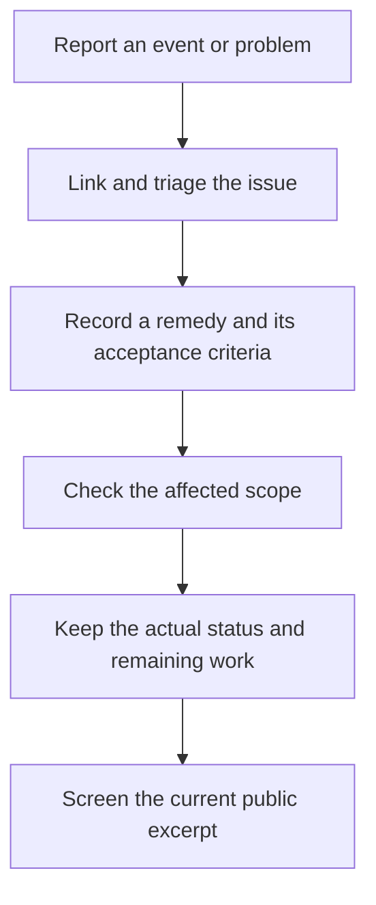

# Reporting errors and tracking issues

Use an issue report for a problem that needs investigation or a change. Use
an error report for one observed event. Link repeated events to the same issue
when their grouping rule matches; a retry, copied report or edited record does
not automatically count as another occurrence.

For the First Post, identify the language, page or PDF section and the version
or retrieval date. Describe what you expected and what you observed. Give
reproduction steps when you have them, or state that reproduction is unknown.
For a wording or translation concern, supply a short permissible excerpt and
your proposed wording. A source link is useful; a private conversation dump
is unnecessary. Suggestions and disagreements can remain suggestions until
the evidence establishes an error.

Keep causes labelled unknown, suspected or demonstrated. Keep every attempted
remedy and its result, including failures. State whether a check used a
fictional fixture, inspected a document or exercised the actual affected
operation. A remedy becomes fixed only after its stated acceptance criteria
pass in the relevant scope; monitoring and remaining work stay visible.

## Public priority values

The reusable template's model is `weighted-issue/1`: impact, reach, recurrence,
persistence and rollback difficulty are scored 1–5. Its weighted total ranges
from 10 to 50. Higher means greater triage priority within this model. Any
missing dimension leaves the total **unscored**. Confidence and verification
cost remain separate, and a score does not certify a cause or a successful fix.

A screened public entry may show only its issue ID, state, fix scope, model
version, total or **unscored**, and a newly written public summary. It need not
publish the individual dimension values, private evidence, names or provenance
behind that judgement. Label it as reviewer triage: readers cannot reconstruct
a withheld assessment from the total alone. Do not copy private rationale into
the public summary. Do not silently present a legacy score with missing values
defaulted to 1 as a fully supported score; label that legacy result provisional
with its model version, or withhold it.

The generic model and its proposed scoring anchors are public in the template;
this does not make the contents of a particular internal assessment public.
Reporters may leave dimensions unknown. Maintainers perform triage after reading
the evidence, and retain changes to the assessment in its record.

## Publication review

Public reports contain only material their author intends and is permitted to
disclose. Remove credentials, personal contact details and private confidences.
Use `#REDACTED#` for unapproved personal names. Internal source quotations,
personal origins and the historical private issue collection require separate
screening; they are not supplied by the reusable download.

Screening applies to the current revision and its linked evidence. A changed
record needs a new review. A scan, hash or reviewer field is evidence of its
stated check; human publication authorization remains a separate requirement.
Use a public-safe summary to describe a problem whose supporting record must
remain private.

This is a reusable reporting policy. It does not claim automatic fault
observation, a live enforcement hook or completed publication.
